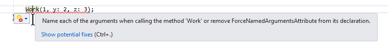
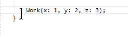
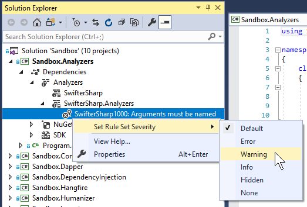

# SwifterSharp

Make C# more like Swift.

<a href="https://www.nuget.org/packages/SwifterSharp"></a>

## Summary

This project is a collection of C# code analyzers that make C# act 
more like Swift. Right now it's a collection of one.

Pull requests are welcome.

## Why do this?

A coworker showed me in Swift you can _require_ named arguments 
when calling a method. In C# these are optional except in a few
circumstances. 

This is a feature I wish C# had. There are some situations when I 
wish I could require callers to explicitly name all arguments, like
to try to prevent transposed arguments or to make transposed
arguments easier to identify. This project is my attempt to add
this feature to C# and make it work more like Swift.

Maybe I'll add more features if I'm further proselytized.

## Analyzers

### ForceNamedArguments

If you add the attribute `ForceNamedArguments` to a method, then
all callers will be forced to explicitly name all arguments when
calling that method. By default not naming all arguments will
result in a compiler error.

For example:

```csharp
[ForceNamedArguments]
public static void Work(int x, int y, int z)
{
    // some work
}
```

Without all arguments named:



With all arguments named:



There's currently no code fix for this error in this package.
Additionally, this attribute currently only targets method. It could
conceivably also target individual method parameters, selectively
requiring some but not all arguments to be named.

## Configuring Analyzers

Analyzer rule severity can be changed by right-clicking the analyzer in
the solution explorer in Visual Studio. For example, to change the
ForceNamedArguments analyzer from its default, an error, to a warning:



If you're not using Visual Studio, since you don't need to in today's
cross-platform world, you can also add a ruleset to your project
or solution and add entries to change SwifterSharp rule severities:

```xml
<Rules AnalyzerId="SwifterSharp.Analyzers" RuleNamespace="SwifterSharp.Analyzers">
  <Rule Id="SwifterSharp1000" Action="Warning" />
</Rules>
```
